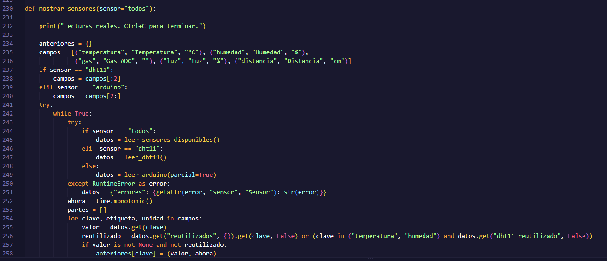
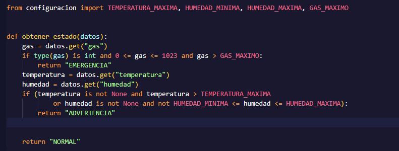
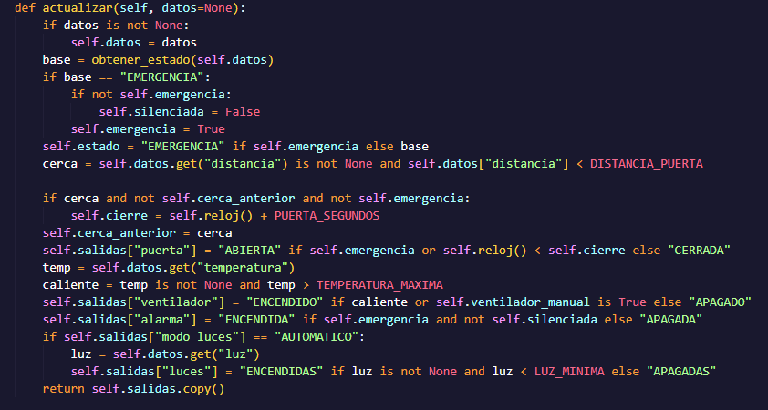
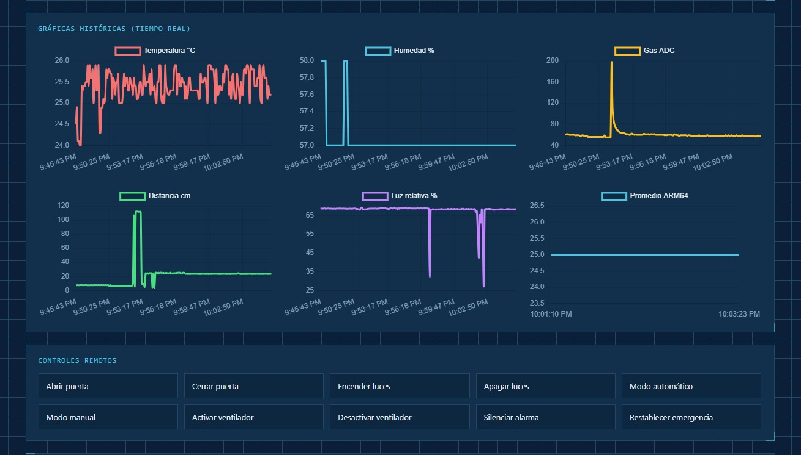
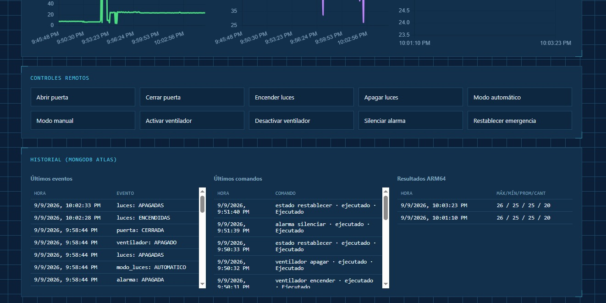
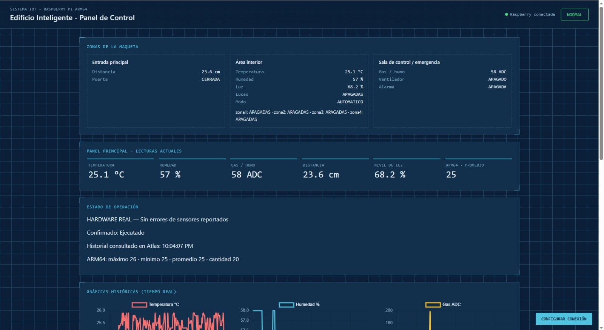
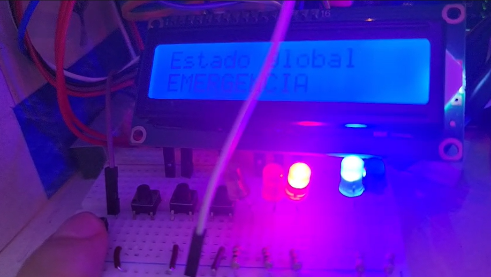
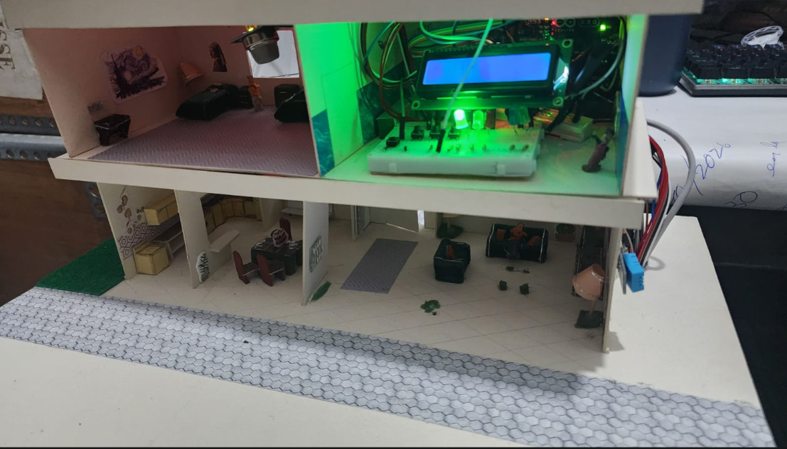

# Proyecto: Edificio Inteligente IoT con Raspberry Pi ARM64

El proyecto consiste en la implementación de un sistema de monitoreo y automatización para un edificio inteligente, donde una Raspberry Pi funciona como unidad principal de procesamiento. El sistema permite adquirir información de sensores ambientales, analizar las condiciones actuales del edificio, ejecutar acciones automáticas sobre actuadores y almacenar información histórica para su visualización mediante un dashboard. La solución es: 

* Python como lenguaje principal de control.
* MQTT como protocolo de comunicación entre dispositivos y dashboard.
* MongoDB como sistema de almacenamiento histórico.
* Arduino como apoyo para la lectura de sensores analógicos.
* ARM64 Assembly para procesamiento.
* Dashboard web para monitoreo y control remoto.

El funcionamiento general se basa en un ciclo continuo donde el sistema obtiene datos de sensores, evalúa el estado del edificio, ejecuta acciones automáticas, almacena información y publica datos para otros componentes.


## Arquitectura del módulo Python

El módulo principal del sistema está ubicado en:

```text
PYTHON/iot/
```

Este módulo funciona como el controlador central del edificio y está organizado de la siguiente forma:

```text
iot/
     main.py
     Globals.py
     sensores.py
     actuadores.py
     estado.py
     hardware.py
     pantalla.py
     mqtt_cliente.py
     base_datos.py
     arm64.py
     graficas.py
     configuracion.py
```

* main.py: es el encargado de coordinar todos los procesos del sistema. Su función principal es mantener el ciclo de operación del edificio inteligente.El ciclo principal funciona utilizando un intervalo configurable, permitiendo realizar lecturas periódicas sin bloquear el funcionamiento del sistema. El flujo ejecutado es:
```text
    1. Inicialización de servicios.
    2. Conexión con MongoDB.
    3. Inicialización MQTT.
    4.	Lectura periódica de sensores.
    5.	Evaluación del estado del edificio.
    6.	Control automático de actuadores.
    7.	Actualización de pantalla LCD.
    8.	Almacenamiento de información.
    9.	Comunicación con dashboard.
    10.	Procesamiento ARM64.
```

* Globals.py: implementa una clase de estado compartido llamada GlobalState. Este módulo funciona como un almacenamiento temporal centralizado donde los diferentes componentes pueden consultar información actual. El uso de este módulo evita tener que enviar información repetida entre funciones y permite que todos los subsistemas trabajen con la misma información actualizada. Mantiene variables como:

        Sensores: temperatura, humedad, gas, distancia, luz.
        Estado: estado_global con valores NORMAL, ADVERTENCIA, EMERGENCIA.
        Actuadores: ventilador, alarma, puerta, luces, modo_luces.
        Resultados ARM64: máximo, mínimo, promedio, cantidad.

* sensores.py: este módulo es responsable de adquirir información proveniente del entorno.

        DHT11: Temperatura y humedad.
        MQ-2: Nivel de gas.
        HC-SR04: Distancia.
        LDR: Nivel de iluminación.

    Además, el módulo permite trabajar con diferentes fuentes:

        sensores conectados directamente a Raspberry Pi. 
        Arduino mediante comunicación USB. 
        modo simulación para pruebas. 
    El modo simulación permite validar la lógica del sistema, aunque no exista conexión física con los sensores.

    

* estado.py: este módulo analiza los valores obtenidos de los sensores y determina la condición actual del edificio.

        Emergencia: se activa cuando existe una condición crítica como detección elevada de gas entonces activa alarma y abre puerta de emergencia. 
        Advertencia: se genera cuando existen valores fuera del rango recomendado como temperatura elevada o humedad fuera del rango permitido. 
        Normal: se mantiene cuando todos los valores están dentro de los límites configurados. 

    

* actuadores.py: este módulo controla las acciones automáticas del edificio. Los actuadores manejados son: ventilador, alarma, puerta, iluminación.




## Modelo de datos del sistema

Para almacenar la información generada por el edificio inteligente se utiliza **MongoDB** como base de datos. La elección de MongoDB permite almacenar información de sensores, eventos y resultados de procesamiento debido a que los datos generados por el sistema tienen una estructura variable y se generan constantemente.

### Colecciones de MongoDB

* sensor_readings: Esta colección almacena las lecturas obtenidas desde los sensores del edificio. Cada registro representa una medición realizada durante un ciclo de ejecución del sistema.

* system_status: Mantiene el estado actual del edificio. A diferencia de las lecturas de sensores, esta colección conserva únicamente el estado más reciente.

* events: Registra eventos importantes ocurridos durante la ejecución, como cambios de estado, activación de emergencia, errores del sistema o acciones importantes.

* commands: Esta colección almacena los comandos enviados desde el dashboard hacia el sistema. Estos comandos permiten realizar acciones manuales sobre los actuadores, como:

    * Abrir puerta.
    * Cerrar puerta.
    * Encender luces.
    * Apagar luces.
    * Silenciar alarma.

* arm64_results: Esta colección almacena los resultados generados por el módulo ARM64.


## Flujo de comunicación MQTT

MQTT es utilizado como protocolo principal de comunicación entre los diferentes componentes del sistema. El módulo Python publica información del sistema y recibe comandos enviados desde el dashboard. La arquitectura de comunicación es:

```text
MQTT
 
    Raspberry Pi / Python
 
    Dashboard
 
    Sensores y actuadores
```

En MQTT existen tres elementos principales:

#### 1. Publisher (Emisor) 
Es el componente encargado de enviar información al bróker. En este proyecto el principal publisher es: Raspberry Pi + Python, el sistema publica:

        Lecturas de sensores.
        Estado general del edificio.
        Estado de actuadores.
        Resultados generados por ARM64.

#### 2. MQTT Broker
Es el intermediario encargado de recibir los mensajes y distribuirlos a los clientes que estén interesados. El bróker permite que el dashboard no tenga que conectarse directamente con la Raspberry Pi. Sus principales funciones son:

        Recibir información publicada.
        Administrar los topics.
        Enviar mensajes a los suscriptores correspondientes.

#### 3. Subscriber (Suscriptor)
Es el componente que recibe los mensajes publicados en los topics a los que está suscrito. En este proyecto, el dashboard puede suscribirse a los topics necesarios para recibir información sobre el estado del edificio, sensores, actuadores y resultados.


#### Topics utilizados

    El sistema publica periódicamente las lecturas obtenidas desde los sensores: edificio/sensores
    El estado general del edificio se publica mediante un topic específico: edificio/estado/global
    Los estados de los dispositivos controlados se envían mediante: edificio/actuadores
    El dashboard puede enviar instrucciones utilizando: edificio/control/remoto

## Funcionamiento del módulo ARM64

El módulo ARM64 se utiliza para realizar procesamiento sobre los datos obtenidos por el sistema.El flujo general de procesamiento es:

Python - datos.txt - ARM64 - resultados.txt - Python

Python ejecuta el programa compilado: programa.o. El programa en ARM64 Assembly procesa los valores recibidos y realiza las operaciones matemáticas correspondientes.

El módulo ARM64 realiza los siguientes cálculos:

* Máximo
* Mínimo
* Promedio
* Cantidad

Después de ejecutar el programa ARM64, Python lee el archivo: resultado.txt y obtiene los valores generados por el procesamiento.Posteriormente, Python:

1. Actualiza el estado interno del sistema.
2. Almacena los resultados en MongoDB.
3. Publica la información mediante MQTT.
4. Permite visualizar los resultados históricos mediante el dashboard.


## Arduino - Raspberry Pi

Dentro de la arquitectura del sistema, Arduino funciona como un módulo complementario encargado de adquirir información de sensores que requieren lectura analógica. Esto se debe a que la Raspberry Pi no cuenta con entradas analógicas integradas, por lo que sensores como el de gas o iluminación necesitan un componente adicional para poder ser interpretados correctamente. 

Arduino funciona como una unidad de adquisición de datos. Sus principales responsabilidades son:

* Leer sensores analógicos.
* Convertir las señales recibidas en valores digitales.
* Enviar los valores mediante comunicación serial.

Arduino no realiza procesamiento de decisiones, solamente obtiene los valores y los transmite.

## Gráficas y Dashboard
 
 El sistema incluye un dashboard web encargado de mostrar información del edificio en tiempo real y permitir acciones de control remoto. La comunicación entre Python y el dashboard se realiza principalmente mediante MQTT. El módulo graficas.py utiliza la información almacenada en MongoDB para generar los datos necesarios para la visualización.

Las principales métricas mostradas son:

* Temperatura histórica
* Humedad histórica
* Nivel de gas
* Distancia registrada
* Nivel de iluminación
* Resultados estadísticos ARM64

Los datos son obtenidos desde las colecciones:

* sensor_readings
* arm64_results
* events

Las gráficas permiten observar el comportamiento del ambiente a través del tiempo.

Temperatura: permite analizar cambios de temperatura durante la ejecución del sistema. Información utilizada:
* timestamp
* temperatura

Humedad: permite identificar variaciones ambientales.Información utilizada:
* timestamp
* humedad

Gas: permite observar incrementos en la concentración detectada y apoyar la detección de situaciones de seguridad. Información utilizada:
* timestamp
* gas





Además de gráficas históricas, el dashboard muestra información actual del sistema:

* Estado del edificio
* Estado de alarma
* Estado de puerta
* Estado de iluminación
* Estado del ventilador




## Flujo de ejecución del sistema

El funcionamiento completo del sistema ocurre mediante un ciclo continuo controlado por main.py. Proceso general: 

    1. Inicio del sistema
    2. Carga de configuración
    3. Inicialización MQTT
    4. Lectura de sensores 
    5. Actualización del estado global
    6. Evaluación NORMAL/ADVERTENCIA/EMERGENCIA
    7. Control automático de actuadores
    8. Actualización LCD
    9. Guardar información en MongoDB
    10. Publicar datos MQTT
    11. Procesamiento ARM64
    

## Configuración para ejecución

Para ejecutar el sistema se requiere configurar el entorno Python y las variables de funcionamiento del sistema.

* Creación: python3 -m venv venv

* Activación: source venv/bin/activate

* Instalación: pip install -r requirements.txt

El sistema se inicia mediante: python3 main.py. Al iniciar correctamente se muestra:

Iniciando sistema del edificio inteligente...
MongoDB conectado.
MQTT conectado.

Posteriormente inicia el ciclo automático de monitoreo.

## Pruebas realizadas

Durante el desarrollo se realizaron pruebas para validar el funcionamiento de los módulos.






